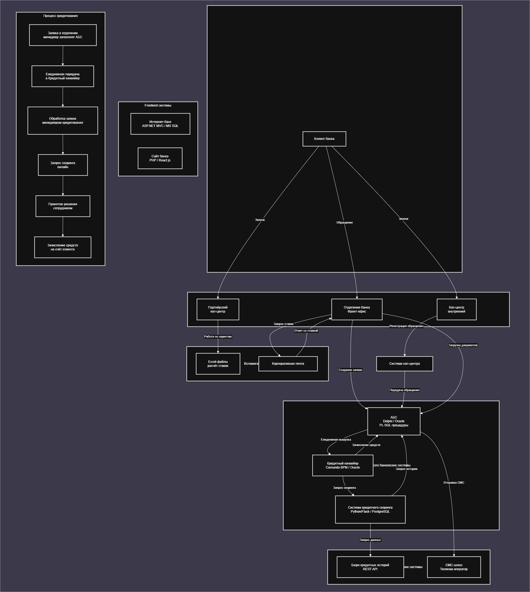
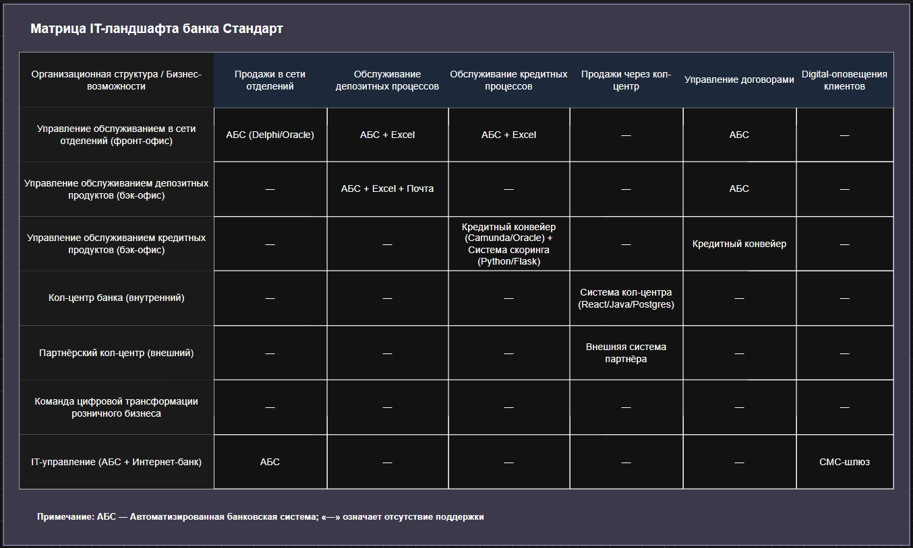

## Задание 1.

##### У вас есть Business Capabilty Map, а также описание организационной структуры предприятия и процессов. 
##### На основе этих данных создайте в draw.io:
- Карту текущего IT-ландшафта.
- Схему интеграции приложений с указанием участников процессов.
- Дополните карту ландшафта и схему интеграции описанием кредитного процесса.

### Пункт 1. Карта текущего IT-ландшафта. 
##### В строках она должна содержать элементы организационной структуры, а в колонках — бизнес-возможности второго уровня. Например, в строке стоит кол-центр, а в колонке — продажи через кол-центр.
  - [Ссылка на drawio файл](integration-scheme.drawio)
  

### Пункт 2. Схема интеграции приложений с указанием участников процессов.
  - [Ссылка на drawio файл](IT-landscape.drawio)

